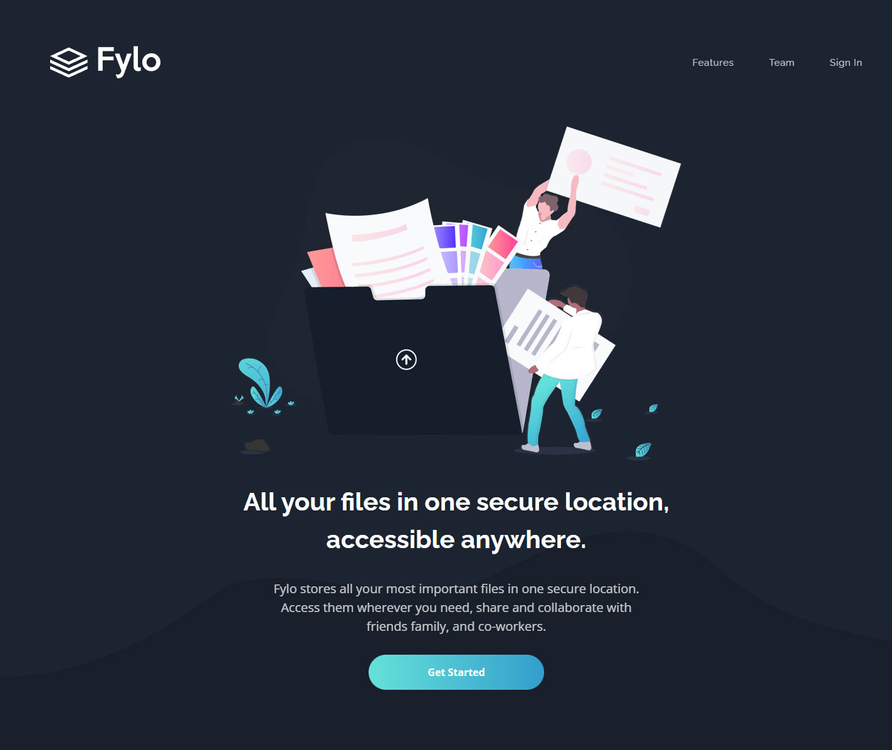

<h1>Fylo dark theme landing page</h1>

  <h3>
    <a href="https://superlative-gelato-8c62b6.netlify.app/"> Live View </a>
     | 
    <a href="https://www.frontendmentor.io/solutions/fylo-landing-page-with-typescript-Rp93QMMrMo"> Solution Page </a>
  </h3>

  A challenge on Frontend Mentor.

## 👍 My Challenges:

- TypeScript used.
- Email verification implemented.
- Scroll to Top button and Sticky Menu implemented.

## 🎉 Build With:

- React + TypeScript
- Semantic HTML5 markup
- Css Flexbox
- Mobile-first workflow
- CSS custom properties
